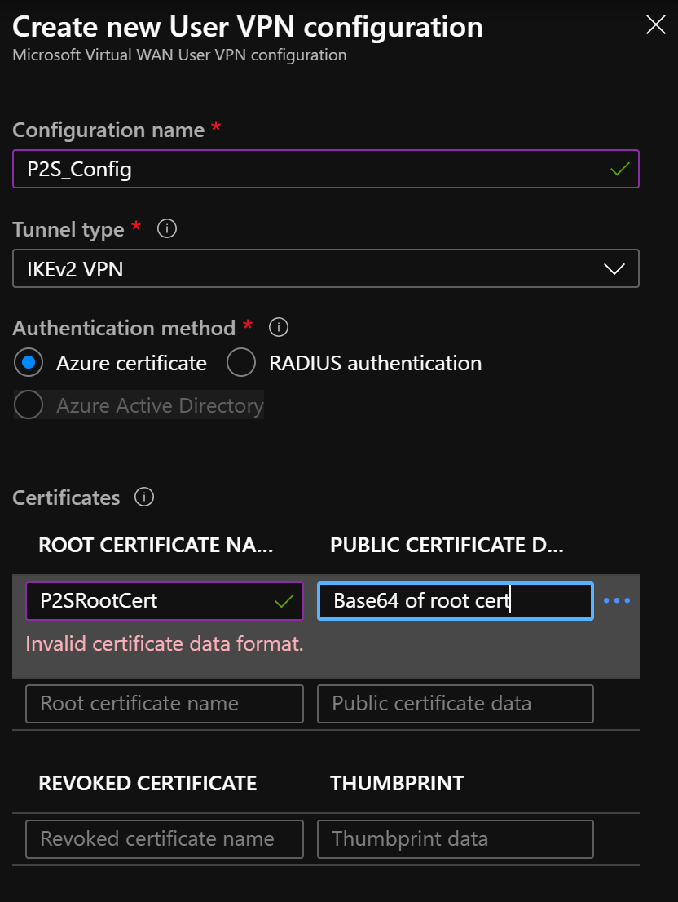

Azure Virtual WAN - POC
-----------------------

A POC to test Azure Virtual WAN, Azure Virtual WAN HUB and Always On VPN.

Details
-------

This is a POC to demonstrate how to use Azure Virtual WAN, a Azure Virtual HUB
within region and P2S (Point to Site) from on-prem into Azure and other
**Spoke** virtual networks.

This POC leverages on Always On VPN with Windows 10 in order to connect securely
and remotely into Azure.

dd

1.  one script is the VPN config XML file which you don't really need (it's the
    method on our docs site how to create a VPN connection). 

 other script is to create all the self-signed certificates that you need,
either user based or machine based - if you want to create a user based or
machine based VPN

 other script is the VPN connection script. Also here is the bit up the top how
it's on our docs site, but my other method below seems to connect the same,
neither get a default gateway, but mine gives this, which you don't get with the
other way documented on our docs site

Azure Portal
------------

In the Azure portal, after you setup Azure Virtual WAN as well as a Virtual HUB,
you want to Create a user VPN config as follows:

The PowerShell script can help you to get **base64** representation of the root
certificate.

\#\#\#\#\#\#\#\#\#\#\#\#\#\#\#\#\#\#\#\#\#\#\#\#\#\#\#\#\#\#\#\#\#\#\#\#\#\#\#\#\#\#\#\#\#\#\#\#\#\#\#\#\#\#\#\#\#\#\#\#\#\#\#\#\#\#\#\#\#\#\#\#\#\#\#\#\#\#\#

\# Azure Stuff, do these other steps in Azure when you setup P2S in the Azure
Virtual WAN Hub

\# This is a simple copy and paste of two pieces of information \| 'PUBLIC
CERTIFICATE DATA' and 'ROOT CERTIFICATE NAME'

\#\#\#\#\#\#\#\#\#\#\#\#\#\#\#\#\#\#\#\#\#\#\#\#\#\#\#\#\#\#\#\#\#\#\#\#\#\#\#\#\#\#\#\#\#\#\#\#\#\#\#\#\#\#\#\#\#\#\#\#\#\#\#\#\#\#\#\#\#\#\#\#\#\#\#\#\#\#\#

\# Copy the Root Base64 to clipboard, paste this Base64 to Azure Virtual WAN, as
PUBLIC CERTIFICATE DATA when you edit the user VPN configuration

\$RootCertificate = Get-ChildItem -Path \$RootCertStore \| where {\$_.Subject
-eq "CN=\$CNroot"}

\$([Convert]::ToBase64String(\$RootCertificate.Export('Cert'),
[System.Base64FormattingOptions]::InsertLineBreaks)) \| clip

Write-Host "The ROOT CERTIFICATE NAME, when you edit the user VPN configuration,
is \$CNroot"

Always On VPN
-------------

**Always On VPN** is a Windows 10 feature that enables the active VPN profile to
connect automatically and remain connected.

**Always On VPN** connections include either of two types of tunnels:

**Device tunnel**: Connects to specified VPN servers before users sign in to the
device. Pre-sign-in connectivity scenarios and device management use a device
tunnel.

**User tunnel**: Connects only after users sign in to the device. By using user
tunnels, you can access organization resources through VPN servers

Test connectivity end-to-end from Windows 10 in the spoke vNet to on-prem.
